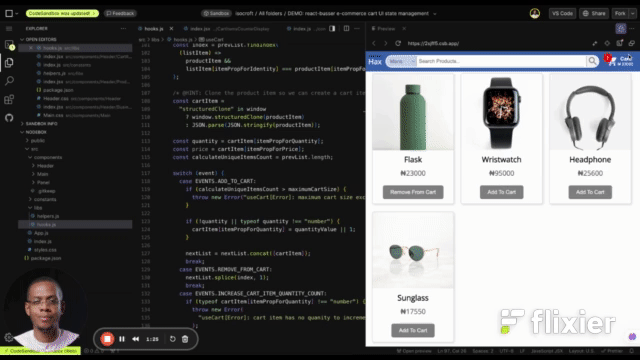

[](https://shields.io/) [](https://shields.io/)  [](http://makeapullrequest.com) [](https://github.com/acekyd/made-in-nigeria)

<h1>busser</h1>

>

A robust, opinionated, UI state flow management option for scalable and precise communication across ReactJS Components rendered on either the client-side or server-side. It heavily compliments [**react-query (@tanstack/react-query)**](https://tanstack.com/query/latest/docs/framework/react/overview). **busser** is a synchronous state manager while [**react-query (@tanstack/react-query)**](https://tanstack.com/query/latest/docs/framework/react/overview) is an asynchronous state manager. Just the same way [**RTK**](https://redux-toolkit.js.org/introduction/getting-started) and [**RTK Query**](https://redux-toolkit.js.org/tutorials/rtk-query) handle UI state and Server state respectively, **busser** and [**react-query (@tanstack/react-query)**](https://tanstack.com/query/latest/docs/framework/react/overview) handle UI state and Server state respectively.

>NOTE: This current version **react-busser** requires ReactJS v16.8.x - 18.2.x and React-Router v5.x.

>Also, please take a look at [this DEMO on codesandbox](https://codesandbox.io/p/sandbox/demo-react-busser-e-commerce-cart-ui-state-management-2sjff5) to see the power of **react-busser**.



## Preamble

This library is made up of custom [ReactJS](https://react.dev/reference/react) hooks that provide basic tools to build stateful web applications that scale well even as the size of UI state and data flow paths grow or ranch out in very undeterministic manners. It makes it very easy to manage not just UI state but data flow across each React components that needs to access, share or recompute state in an effiecient manner. **busser** achieves this by using an *event bus*, eliminating *wasteful re-renders* where necessary by employing signals and utilizing *the best places to store* specific kinds of UI state.

>There are 2 broad categories into which we can classify all of the state that any ReactJS app deals with

1. Transient or Temporary state (e.g. UI state, derived state)
2. Non-Transient or Permanent state (e.g. Server state, base state)

Read more about it [here](https://isocroft.medium.com/introducing-react-busser-designing-for-better-application-data-flow-in-reactjs-part-1-5eb4e103eff9)

So, why create **busser** ? Well, after using a lot of state managers like [Redux](https://redux.js.org/), [RTK Query](https://redux-toolkit.js.org/tutorials/rtk-query), [Zustand](https://docs.pmnd.rs/zustand/getting-started/introduction) and [Jotai](https://jotai.org/docs/introduction). I found that the flow of data was very restricted/contrained because state (most state if not all state) was being stored in a single place (or slices of a single place - [RTK Query](https://redux-toolkit.js.org/tutorials/rtk-query), [Zustand](https://docs.pmnd.rs/zustand/getting-started)). I needed state to flow to where it was needed without gates or having to bypass or workaround predetermined routes. Also, most state managers out there are built in such a way that it encourages the storage and management of both UI state and server state be handled in the different parts of the same "machine" tightly couples together.

Therefore, **busser** takes a different approach by only handling UI state and leaving server state to be handled by something else like [**react-query (@tanstack/react-query)**](https://tanstack.com/query/latest/docs/framework/react/overview).

There are 3 places that **busser** stores UI state:

1. Storage (e.g. localStorage)
2. URL
3. Memory (e.g. JavaScript variables)

Storing state appropriately in these 3 places makes it really easy for data to flow unrestricted through your React frontend to get to all the places/client components it needs to go. I like to call **busser**: the all-in-one UI state manager. However, **busser** not only manages state but also manages the flow of state from one client component to another.

Additionally, **busser** is reactive alternative to the interactive model found in the way React works already. ReactJS makes use of imperative command-driven interactive APIs like `setState(...)` to drive UI updates. **busser** uses a different approach to this interactive model which is the reactive model (using an event bus to communicate shared data across multiple React. components).

When learning the [**_Go programming language_**](https://go.dev), in the section on [_Concurrency_](https://go.dev/doc/effective_go#concurrency), there's this saying:

>Do not communicate by sharing memory; instead, share memory by communicating

This is the basis of how **busser** works at its core, unlike _Redux_ and _Zustand_ that communicate by sharing memory (or sharing the store that contains the data to different ReactJS components), **busser** shares memory by communicating (or sharing the data via an event bus to different ReactJS components instead of the store).

>Hooks that manage state in the **URL**

- `useSearchParamsState()`
- `useSearchParamStateValue()`
- `useSearchParamStateValueUpdate()`

>Hooks that manage the flow of state in the **URL**

- `useRoutingChanged()`
- `useRoutingBlocked()`
- `useRoutingMonitor()`

#### ------------------------------------------------------

>Hooks that manage state in **Storage**

- `useBrowserStorage()`
- `useBrowserStorageWithEncryption()`

#### ------------------------------------------------------

>Hooks that manage the flow of state in **Storage**

- `useBrowserStorageEvent()`

#### ------------------------------------------------------

>Hooks that manage state in **Memory**

- `useList()`
- `useComposite()`
- `useCount()`
- `useProperty()`
- `usePromised()`
- `useSignalsList()`
- `useSignalsComposite()`
- `useSignalsCount()`
- `useSignalsProperty()`

>Hooks that manage flow of state in **Memory**

- `useBus()`
- `useOn()`
- `useSharedState()`

#### ------------------------------------------------------

>Hooks specialized for specific tasks

- `useWindowSize()`
- `useLockBodyScroll()`
- `useGeoLocation()`
- `useControlKeysPress()`
- `useStateUpdatesWithHistory()`
- `useTextFilteredList()`
- `useTextSortedList()`
- `useTextFilteredSignalsList()`
- `useBroswserNetworkStatus()`
- `useBrowserScreenActivityStatusMonitor()`
- `useUICommands()`

It's very important to note that **busser** exists only because of the [inefficiencies present in the implementation](https://www.youtube.com/watch?v=qSQtKtmj4M0) of [ReactJS](https://react.dev/reference/react). ReactJS claims to be wholly reactive but it really isn't because ReactJS is by definition a tree of interactive components, imperatively controlling and communicating with one another. This creates the restriction (i was speaking about earlier) for the pathways that data can travel in the web application. Libraries like [MobX](https://mobx.js.org/README.html), pursue the wholly reactive option using Observables. However, **busser** borrows from [MobX](https://mobx.js.org/README.html) but unlike MobX, **busser** makes the component wholly reactive from the inside rather than from the outside.

Read more about this [here](https://futurice.com/blog/reactive-mvc-and-the-virtual-dom).

Though **busser** tries to sidestep these inefficiencies to a large extent, it only goes so far in doing so. Finally, **busser** will have no reason to exist if these inefficiencies never existed in ReactJS in the first place.

Here is an introductory example of how to use the `useBrowserStorage()` and `useUICommands()` hooks

```tsx
import React, { useRef } from "react";
import {
  useBrowserStorage,
  useUICommands
} from "react-busser";

export function App () {
  const listRef = useRef<HTMLUListElement | null>(null);
  const { getFromStorage } = useBrowserStorage({
    storageType: "local" /* @HINT: makes use of `window.localStorage` */
  });

  const commands = useUICommands({
    print: { /*  @HINT: Print command options */
      documentTitle: "My Printed List",
      onBeforePrint: () => console.log("before printing...."),
      onAfterPrint: () => console.log("after printing...."),
      nowPrinting: () => console.log("currently printing...."),
    }
  });

  const list = getFromStorage<string[]>("list", []);

  return (
    <>
    <ul ref={listRef}>
      {list.map((listItem) => {
        return <li key={listItem} onClick={() => {
          commands.hub.copy(
            listItem
          )
        }}>{listItem}</li>
      })}
    </ul>
    <button onClick={() => commands.hub.print(listRef)}>
      Print List
    </button>
    </>
  )
}
```

Here's another introductory example of how to use the `useTextSortedList()` hook

```tsx
import React, { useEffect } from 'react';
import ReactDOM from 'react-dom';
import { SORT_ORDER, useTextSortedList, useIsFirstRender } from 'react-busser';

import './App.css';

type Article = {
  title: string,
  upvotes: number,
  date: string
};

type NormalizedArticle = Omit<Article, "date"> & { date: Date }

function useSortedArticles (articles: Article[]) {
  const normalizedArticles: NormalizedArticle[] = Array.isArray(articles) ? articles.map((article) => {
    return {
      ...article,
      /* @HINT: Turn date string into JavaScript Date object */
      date: new Date(article.date)
    }
  }) : [];

  const isFirstRender = useIsFirstRender();
  const [sortedArticles, handleSortFor] = useTextSortedList(
    normalizedArticles, SORT_ORDER.ASCENDING, "title"
  );

  useEffect(() => {
    if (isFirstRender) {
      handleSortFor("upvotes", SORT_ORDER.DESCENDING)
    }
  /* eslint-disable-next-line */
  }, [isFirstRender]);

  return [sortedArticles.map((sortedArticle) => {
    return { 
      ...sortedArticle,
      /* @HINT: Turn JavaScript Date object back into a date string */ 
      date: sortedArticle.date.toLocaleDateString(
      ).split('/').reverse().join('-')
    }
  }), handleSortFor] as const;
}

function Articles({ articles = [] }:{ articles: Article[] }) {
  return (
    <div className="card w-50 mx-auto">
      <table>
        <thead>
          <tr>
            <th>Title</th>
            <th>Upvotes</th>
            <th>Date</th>
          </tr>
        </thead>
        <tbody>
            {articles.map((article) => {
              return (
                <tr data-testid="article" key={article.title + "_" + article.upvotes}>
                  <td data-testid="article-title">{article.title}</td>
                  <td data-testid="article-upvotes">{article.upvotes}</td>
                  <td data-testid="article-date">{article.date}</td>
                </tr>
              );
            })}
        </tbody>
      </table>
    </div>
  );
}

function App({ articles = [] }: { articles: Article[] }) {
  const [sortedArticles, handleSortFor] = useSortedArticles(articles);

  return (
    <div className="App">
      <div className="layout-row align-items-center justify-content-center my-20 navigation">
          <label className="form-hint mb-0 text-uppercase font-weight-light">Sort By</label>
          <button data-testid="most-voted-article" className="small" onClick={() => {
            handleSortFor("upvotes", SORT_ORDER.DESCENDING)
          }}>Most Upvoted</button>
          <button data-testid="most-recent-article" className="small" onClick={() => {
            handleSortFor("date", SORT_ORDER.DESCENDING)
          }}>Most Recent</button>
      </div>
      <Articles articles={sortedArticles} />
    </div>
  );
}

ReactDOM.render(<App articles={[
  {
    title: "A message to our customers",
    upvotes: 12,
    date: "2020-01-24",
  },
  {
    title: "Alphabet earnings",
    upvotes: 22,
    date: "2019-11-23",
  }
]} />, document.getElementById('root'));
```

## Motivation

The philosophy of [ReactJS](https://react.dev/reference/react) can be summarized using 2 phrases: *uni-directional data flow* and *view-model state reconciliation*. This philosophy is great for the most part (as it promotes things like the [locality of behavior](https://freek.dev/2423-locality-of-behavior)) until you need to have fine-grained state updates (not to be confused with fine-grained reactivity). [ReactJS](https://react.dev/reference/react) doesn't utilize reactivity at any level - This is because that goes against the "re-render everything with idempotence" mantra. [ReactJS](https://react.dev/reference/react) strongly suggests that side effects be hidden inside `useEffect()` and only deal with React-y stuff inside components and hooks but it's not always that simple. Firstly, `useEffect()` dependency list doesn't play nice with reference types (object, object literals and arrays). Secondly, `useMemo()` and `useCallback()` don't offer memoization in the true sense of the word - they only offer memoization between one render and the very next render following in turn. Finally, it's not every time you want a state change to trigger a re-render (especially of an entire sub-tree). Also, it's also not every time you need user interaction(s) on the UI to lead to a state change that eventually updates the UI (after consulting the VDOM). These cases are not catered for completely by [ReactJS](https://react.dev/reference/react) out-of-the-box. Though, the React core team [has made some effort](https://github.com/reactwg/react-18/discussions/21) to cater to these issues over time but it hasn't been comprehensive. Even until recently, with the promotion of [React Forget](https://m.youtube.com/watch?v=qOQClO3g8-Y&feature=youtu.be), ReactJS still struggles with providing a more comprehensive solution to the re-render problem. 

Furthermore, there's an increase in the use of [React Context](https://legacy.reactjs.org/docs/context.html) in building our react apps because of it many benefits. However, [React context has it's own drawbacks too](https://blog.logrocket.com/pitfalls-of-overusing-react-context/) and also it's [painful performance issues at scale](https://github.com/bvaughn/rfcs/blob/useMutableSource/text/0000-use-mutable-source.md#context-api). Also, over-using [props](https://legacy.reactjs.org/docs/components-and-props.html#props-are-read-only) to pass data around and/or trigger state changes can slow [React](https://legacy.reactjs.org/) down significantly especially at scale. You might say: *"So ? that's exactly why React context was created - to help avoid prop drilling"* and you'd be partly right but (as stated earlier) using `useContext()` excessively can also lead to [wasteful re-renders](https://jotai.org/docs/basics/concepts). Sure, this *"wasteful re-renders"* issue can be solved with libraries like [**use-context-selector**](https://www.npmjs.com/package/use-context-selector) but again at a very high cost and has some limitations. The deeper a component using `useContext()` is in the component-tree hierarchy of a ReactJS app combined with more frequent UI state changes, the slower at rendering (and re-rendering) the app becomes even without **props**. All these issues are negligible with small ReactJS app with little client-side interactivity. However, they become more pronounced over time in large ReactJS apps that have a much larger scale of client-side interactivity.

Busser seeks to reduce and/or eliminate these issues as much as is possible so you don't have to think too much about things that don't make you more productive at resolving bugs or building out features. Busser proposes a new way. This way involves reducing the number of props used by components to pass/transfer data by utilising events instead. This way/method is known as *"pruning the leaves"*. What this way/method of setting up data transfer amongst React components tries to achieve is to **"prune the leaves"** of the component tree and make fine-graned state updates easy and possible. The prolific teacher of ReactJS ([@kentcdodds](https://twitter.com/kentcdodds)), wrote something resembling this idea of "pruning leaves" the component tree here: [https://epicreact.dev/one-react-mistake-thats-slowing-you-down](https://epicreact.dev/one-react-mistake-thats-slowing-you-down/). This makes the entire component tree faster at re-rending by making the children of erstwhile parent components to be siblings. 

Therefore, this package (busser) seeks to promote the idea that communication between React components should not be limited to **props/context** or through parent components alone. It utilizes the `Mediator Coding Pattern` (event bus model) to allow components communicate in a more constrained yet scalable way. This package was inspired partially by [**react-bus**](https://www.github.com/goto-bus-stop/react-bus), [**redux**](https://redux.js.org/introduction/examples#counter-vanilla) and [**jotai**](https://jotai.org/docs/core/atom). This package can also be used well with [**react-query (@tanstack/react-query)**](https://github.com/tannerlinsley/react-query) to create logic that can work hand-in-hand to promote less boilerplate for repititive react logic (e.g. data fetching + management) and promote cleaner code.

#### Why is it necessary to adopt this novel way with Busser ?

>There are 2 major reasons why it's important to "prune the leaves" of React component tree for your app as seen below:

1. The virtual DOM is vital to how React works but also presents challenges of it's own in the manner in which it works. Some of these challenges include updating leave DOM nodes too often and not optimizing DOM updates where text node values are unchanged. The idea here is to try to workaround these challenges by trying to minimize the amount of wasteful re-renders the virtual DOM is bound to honour so that:

- 1. **The tree diff algorithm doesn't keep updating leaf (and parent) nodes that do not need to be updated**: The premise for this is that the time complexity of the tree diff algorithm used in ReactJS is linear time (O(n)) and doesn't just swap values (e.g. DOM attributes, DOM text nodes) in place (the way [signals](https://millermedeiros.github.io/js-signals/) do) from the virtual DOM to the real DOM. It actually replaces it in a [top-down replacement approach](https://programming.vip/docs/realization-and-analysis-of-virtual-dom-diff-algorithm.html#:~:text=The%20big,performance%20problem), the entire sub-tree and not just the node that changed. Therefore, you might end up with [bugs like this one](http://www.eventbrite.com/engineering/a-story-of-a-react-re-rendering-bug) sometimes.

- 2. **The CPU computation cost due to the tree diff algorithm used in updating/commiting into the DOM is minimized**: The premise here is that computing the difference between the real DOM and virtual is usually expensive when the scale of client interactivity is high.

2. The amount of wasteful re-renders are intensified without much effort in an almost exponential manner as the component tree grows deeper and wider/larger. In fact, when it comes to rendering thing like lists or modals, it is imperetive ([as far as React is concerned](https://legacy.reactjs.org/redirect-to-codepen/reconciliation/no-index-used-as-key)) that extra steps be taken by the developer to aid the heuristics/assumptions used by the Virtual DOM in reconciling the DOM in an inexpensive manner. React, by default, [cannot perform optimizations without these extra steps](https://legacy.reactjs.org/redirect-to-codepen/reconciliation/index-used-as-key).

- 1. **All ReactJS Memo APIs that require a dependency array make use of an empty one**: The premise of this is that even though the `useMemo()` and `useCallback()` function APIs could be utilized to greatly reduce the number of wasteful re-renders. However, sometimes, tools like `useMemo()` and `useCallback()` [don't always work well to reduce wasteful re-renders](https://tkdodo.eu/blog/the-uphill-battle-of-memoization) (especially when the dependency array passed to these hooks contains values (especially reference types) that change very frequently and so do not have referential stability between renders). Now, with the coming of [ReactJS 19 and its' big set of changes](https://daily.dev/blog/react-19-everything-you-need-to-know-in-one-place), some of these `memo` APIs will be retired in favour of a [compiler](https://www.builder.io/blog/react-compiler-will-not-solve-prop-drilling). Also, the React team has released the [`useEffectEvent()` hook](https://react.dev/reference/react/useEffectEvent) which was derived from the now decommisioned: [`useEvent()` hook](https://github.com/reactjs/rfcs/pull/220#issuecomment-1259938816) in ReactJS v19.2. This new hook will help in situations where the dependency array of `useEffect()` could be filled with values that don't have referential stability between renders.
 

#### Busser: the novel way

It's important to note that **busser** can be used in one or all of 3 scenarios:

1. Sharing global base/derived state across multiple ReactJS components.
2. Sharing local base state across multiple ReactJS components.
3. Sharing local derived state across multiple ReactJS components.

Global state is managed by the `useSharedState()` hook (or the `useSharedSignalsState()` - if you prefer to use [signals](https://preactjs.com/guide/v10/signals/)) which should only be used when state needs to be accessed/shared and updated by multiple client-side components.

There are a couple of rules that should be top of mind when using busser in any of these scenarios for maximum benefit. They are as follows:

1. Do not grow the component tree depth-wise, it's [better to grow it breadth-wise instead](https://web.dev/articles/dom-size-and-interactivity#how_can_i_reduce_dom_size) (whenever you can) to cut down the use of **props** drastically (especially props that change often - transient state / UI state).
2. Endeavour to pass mostly non-transient data via props to [presentation/leaf components](https://www.patterns.dev/posts/presentational-container-pattern) and seldom to [container components](https://www.section.io/engineering-education/container-components-in-react/). If it is ever a must to pass transient data via props, let it be at the top of the component-tree hierarchy of the ReactJS app.
3. All props should only be delivered from exactly one parent component to exactly one child component at any time (but there can be exceptions).
4. Make use of [key prop](https://legacy.reactjs.org/docs/reconciliation.html#keys) when rendering ReactJS components whether in a loop or not. This can help the  Virtual DOM with ae-arranging and re-rendering in a cheaper way.

## Old Concepts, New Setup

At the core, busser is simply a collection of ReactJS hooks. The concept of an [event bus](https://medium.com/elixirlabs/event-bus-implementation-s-d2854a9fafd5) (implemented using the `Mediator Coding Pattern` or `Pub/Sub`) employed to pass data around in parts of a frontend (and backend) software applications isn't new. This (pub/sub - think Redis) concept has been around for a long time in software developement and while being very vital to service-oriented/kernel software architecture and systems, it has been plagued in its use at scale when deployed on frontend web applications by lacking a set of correct and adequate logic constraints at scale as well as debug data about the events being fired in an orderly (and not a hapharzard) manner. It's very easy to overuse and by consequence get overwhelmed by the sheer number and frequency of events (from event buses) and data being fired and passed around respectively. However, the biggest issue with this concept at scale is managing the predicatability and flow of these events. So, this project proposed 1 specific way to communicate across components (as broadcasts - i.e. events fired from source to destination):

- cascade broadcasts

Therefore, the philosophy upon which **react-busser** operates is as follows:

1. An evented object (event bus) system built on ReactJS hooks.
2. Builds upon the existing state management features (`useState()`, `useRef()`, `useCallback()`, `useContext()`) already provided by ReactJS.
3. Emphazises and encourages prudent use of ReactJS props as well as the creation of deeply nested child components only when necessary.
4. Favours the creation of sibling components over (remember as earlier said 👆🏾 - "prunning the leaves") the creation of more child components.
5. Makes ReactJS component and business logic (in ReactJS hooks) more readable, reusable and maintainable by decoupling and relegating such logic to the ReactJS component that truly OWNS the logic (and not ancestor/parent components).

<em>Take a look at examples of custom ReactJS hooks built with react-busser:</em>

- Let's create a hook for knowing when a page element is scrolled vertically

```typescript
import { useEffect, MutableRefObject, ComponentProps } from 'react';
import { useBus } from 'react-busser';

export const useVerticallyScrolled = (
  { threshold = 100 }: { threshold: number },
  ref: MutableRefObject<HTMLElement>
) => {
  const [ bus ] = useBus(
    { subscribes: [], fires: ["document:vertical:scrolled"] },
    "App.document"
  );

  useEffect(() => {
    const target = ref && ref.current.nodeName !== "HTML" ? ref.current : window;
    const handleScroll = () => {
      let value = -1;
      let boxGap = target.offsetHeight - target.clientHeight;
      let offset = target.pageYOffset
        || (target.scrollHeight - target.clientHeight - boxGap)
          || target.scrollTop;

      if (offset <= threshold) {
        value = offset;
      } else {
        value = threshold;
      }

      bus.emit("document:vertical:scrolled", value);
    };
    target.addEventListener("scroll", handleScroll);

    return () => {
      target.removeEventListener("scroll", handleScroll);
    };
  /* eslint-disable-next-line react-hooks/exhaustive-deps */
  }, [threshold, ref]);
}

// useVerticallyScrolled({ threshold: 450 });
```

- Let's take a look at creating a compound dropdown component that uses no React state and no context 

>Step 1: Create a hook to handle dropdown UI state in both React and the DOM

```js
import { useEffect, useRef, useCallback } from 'react';
import { useBus, useComposite } from 'react-busser';

export const useDropdownCore = (
  items = [],
  key,
  dropDownEventName = "combobox:change",
  toggleClassName = "show-list"
) => {
  const itemsCopy = items.slice(0);
  const  [bus] = useBus({
    fires: [dropDownEventName],
    subscribes: []
  }, key);
  const dropdownRef = useRef(new Map()).current;
  const [composite, handleUpdatesFactory] = useComposite(
    "__dropdown:menu:change",
    (prevComposite, nextComposite) => {
      return {
        ...prevComposite,
        ...nextComposite
      }
    },
    {
      selectedIndex: -1,
      selectedItem: null
    },
    key
  );

  useEffect(() => {
    /* @HINT: Trigger single/stream braodcast in the cascade chain */
    bus.emit(dropDownEventName, { composite, key });
  /* eslint-disable-next-line react-hooks/exhaustive-deps */
  }, [bus, composite.selectedIndex, dropDownEventName, key]);

  const onSelectedItemChange = handleUpdatesFactory("__dropdown:menu:change");

  const handleKeys = useCallback(() => undefined, []);

  const toggleOpenState = useCallback(() => {
    const dropdownListNode = dropdownRef.get(key);

    if (dropdownListNode) {
      dropdownListNode.classList.toggle(toggleClassName);
    }
  /* eslint-disable-next-line react-hooks/exhaustive-deps */
  }, [key])

  const setSelectedItem = useCallback((index) => {
    const dropdownListNode = dropdownRef.get(key);

    if (dropdownListNode) {
      dropdownListNode.classList.remove(toggleClassName);
    }

    onSelectedItemChange({
      selectedIndex: index,
      selectedItem: itemsCopy[index]
    });
  /* eslint-disable-next-line react-hooks/exhaustive-deps */
  }, [key, itemsCopy.map(item => (item.id || item.value || item.text)).join('|')]);

  return {
    composite,
    handleKeys,
    dropdownRef,
    toggleOpenState,
    setSelectedItem
  };
};

```

>Step 2: Implement the compound components

```jsx
import React, { useEffect } from "react";
import pick from "lodash.pick";

import { useDropdownCore } from "./hooks";

const hasChildren = (children, count) => {
  const childCount = React.Children.count(children);
  return childCount === count;
};

const Trigger = ({
  as: Component = "input",
  children,
  className,
  style,
  ...props
}) => {
  const getLabelText = (selectedItem, defaultText, children) => {
    const noChild = hasChildren(children, 0);

    if (!noChild) {
      if (selectedItem) {
        return selectedItem?.text || "<unknown>";
      }
      return children || defaultText;
    }

    return selectedItem
      ? selectedItem?.text || "<unknown>"
      : defaultText || "Select an item...";
  };

  return (
    <>
    <Component
      tabIndex={0}
      key={props.placeholder}
      onClick={() => props.onTriggerClick()}
      className={className}
      role={props.type === "button" ? "button" : "combobox"}
      aria-expanded={props.type !== "button" ? "false" : undefined}
      style={style}
      id={props.placeholder}
      {...props}
    >
      {props.type === "button" ? getLabelText(
        props.composite.selectedItem,
        props.placeholder,
        children
      ) : null}
    </Component>
    {props.type === "text" ? <span aria-hidden="true" data-trigger="multiselect"></span> : null}
    </>
  );
};

const ListItem = ({
  as: Component = "li",
  children,
  className,
  style,
  ...props
}) => {
  return (
    <Component className={className} style={style} role="listitem" {...props}>
      {children}
    </Component>
  );
};

const List = ({
  as: Component = "ul",
  children,
  className,
  style,
  render,
  items,
  ...props
}) => {
  const noChild = hasChildren(children, 0);
  return (items.length > 0 ? (
    <Component
      className={className}
      style={style}
      role="listbox"
      ref={props.innerRef}
      items={Component === "ul" || Component == "ol" ? undefined : items}
      composite={Component === "ul" || Component == "ol" ? undefined : props.composite}
      onClick={Component === "ul" || Component == "ol" ? undefined : ('onListItemClick' in props) && props.onListItemClick || undefined}
    >
      {noChild
        ? items.map((item, index) => (
            <ListItem
              key={String((item.id || item.text) + "_" + index)}
              selected={index === props.composite.selectedIndex}
              onClick={() => ('onListItemClick' in props) ? props.onListItemClick(index) : undefined}
            >
              {
                typeof render === "function"
                ? render(item, index === props.composite.selectedIndex)
                : item.text
              }
            </ListItem>
          ))
        : children({
          items,
          composite: props.composite,
          onClick: ('onListItemClick' in props) && props.onListItemClick || undefined
        })
      }
    </Component>
    ) : null
  );
};

const Dropdown = ({
  items = [],
  placeholder = "",
  onChange = () => undefined,
  tabIndex,
  name,
  id,
  className,
  children
}) => {
  const isSubChild = (child, tag) =>
    React.isValidElement(child) && String(child?.type).includes(tag);

  const renderChildren = (children, extraChildProps) => {
    const oneChild = hasChildren(children, 1);
    const noChild = hasChildren(children, 0);

    if (noChild || oneChild) {
      console.error("[Error]: <Dropdown /> requires no less than 2 valid children; <Dropdown.Trigger /> and <Dropdown.List />");
      return null;
    }

    const childrenList = React.Children.toArray(children);

    if (typeof children === "object") {
      if (children !== null && Array.isArray(childrenList)) {
        return childrenList.map((child) => {
          if (!("props" in child)) {
            return null;
          }

          switch (true) {
            case isSubChild(child, "Trigger"):
              return React.cloneElement(
                child,
                pick(extraChildProps, [
                  "onTriggerClick",
                  "placeholder",
                  "composite"
                ])
              );

            case isSubChild(child, "List"):
              return React.cloneElement(
                child,
                Object.assign(
                  {},
                  pick(extraChildProps, [
                  "items",
                  "onListItemClick",
                  "composite"
                ]), {
                  innerRef: (node) => {
                    return !node
                      ? extraChildProps.dropdownRef.delete(id)
                      : extraChildProps.dropdownRef.set(id, node);
                  }
                })
              );

            default:
              return React.isValidElement(child) ? child : null;
          }
        });
      }
    }

    return null;
  };

  const {
    composite,
    toggleOpenState,
    dropdownRef,
    handleKeys,
    setSelectedItem
  } = useDropdownCore(items, id, "$__dropdown:change:braodcast");

  useEffect(() => {
    if (composite.selectedIndex !== -1) {
      onChange(composite.selectedItem);
    }
  /* eslint-disable-next-line react-hooks/exhaustive-deps */
  }, [composite.selectedIndex]);

  return (
    <div name={name} id={id} tabIndex={tabIndex} onKeyDown={handleKeys} className={className} role="group">
      {renderChildren(children, {
        items,
        placeholder,
        onTriggerClick: toggleOpenState,
        onListItemClick: setSelectedItem,
        composite,
        dropdownRef
      })}
    </div>
  );
};

Dropdown.Trigger = Trigger;
Dropdown.List = List;
Dropdown.ListItem = ListItem;

const DropdownEvent = {
  DROPDOWN_CHANGE_BROADCAST: "$__dropdown:change:braodcast"
};

export { Dropdown, DropdownEvent };
```

>Step 3: Use the component and its' event

```jsx
import  React, { useState, useEffect } from 'react';
import { Dropdown, event } from './components/Dropdown';
import './styles.css';

import { useBus } from 'react-busser';

export function DropdownBoard () {
  const getOrdinalSuffix = (num = 0, asWord = false) => {
    let ordinal = "th";

    if (num % 10 === 1 && num % 100 !== 11) {
      ordinal = "st";
    }
    else if (num % 10 === 2 && num % 100 !== 12) {
      ordinal = asWord ? "ond" : "nd";
    }
    else if (num % 10 === 3 && num % 100 !== 13) {
      ordinal = "rd";
    }

    return !num && num !== 0 ? '' : ordinal;
  };

  const getNumbering = (num = 0, asWord = false) => {
    const tens = [
      "zero",
      "fir",
      "sec",
      "thi",
      "four",
      "fif",
      "six",
      "seven",
      "eig",
      "nin",
      "ten",
      "eleven",
      "twelv",
      "thirteen",
      "fourteen",
      "fifteen",
      "sixteen",
      "seventeen",
      "eighteen",
      "nineteen"
    ];
    const hundreds = [
      "",
      "",
      "twentee",
      "thirtee",
      "fortee",
      "fifthee",
      "sixtee",
      "seventee",
      "eigh",
      "nine"
    ];

    if ((num.toString()).length > 9) {
      return "overflow";
    }
      
    const numString = ("000000000" + num).substr(
      -9
    ).match(
      /^(\d{2})(\d{2})(\d{2})(\d{1})(\d{2})$/
    );
      
    if (!numString) {
      return ""; 
    }

    const [ , first, second, third, fourth, fifth ] = numString;
      
    let numberingString = "";

    numberingString += (Number(first) !== 0) ? (tens[Number(first)] || hundreds[Number(first[0])] + " " + tens[Number(first[1])]) + "crore " : "";
    numberingString += (Number(second) !== 0) ? (tens[Number(second)] || hundreds[Number(second[0])] + " " + tens[Number(second[1])]) + "lakh " : "";
    numberingString += (Number(third) !== 0) ? (tens[Number(third)] || hundreds[Number(third[0])] + " " + tens[Number(third[1])]) + "thousand " : "";
    numberingString += (Number(fourth) !== 0) ? (tens[Number(fourth)] || hundreds[Number(fourth[0])] + " " + tens[Number(fourth[1])]) + "hundred " : "";
    numberingString += (Number(fifth) !== 0) ? ((numberingString !== "") ? "and " : "") + (tens[Number(fifth)] || hundreds[Number(fifth[0])] + " " + tens[Number(fifth[1])]) + getOrdinalSuffix(num, asWord) : "";
    
    return numberingString;
  };
  const [dropDownDetails, setDropDownDetails] = useState(() => ({
    key: "__dropdownId_32049",
    composite: { seletedIndex: -1, selectedItem: null }
  }));
  const [ bus ] = useBus({
    fires: [],
    subscribes: [event.DROPDOWN_CHANGE_BROADCAST]
  });

  useEffect(() => {
    const callBack = ({ key, composite }) => {
      setDropDownDetails((prevDropDownDetails) => {
        switch (true) {
          case key === dropDownDetails.key:
            return {
              ...prevDropDownDetails,
              composite
            };
          default:
            return prevDropDownDetails;
        }
      });
    };
  
    bus.on(event.DROPDOWN_CHANGE_BROADCAST, callBack);

    return () => {
      bus.off(callBack);
    }
  /* eslint-disable-next-line react-hooks/exhaustive-deps */
  }, [dropDownDetails.key, bus]);

  return (
    <div>
      Dropdown Component with key =
      {dropDownDetails.key} 
      was changed to 
      {dropDownDetails.composite.selectedIndex === -1
        ? "an unknown"
        : `the ${getNumbering(dropDownDetails.composite.selectedIndex + 1, true)}`}
      value
    </div>
  )
}

export function Dropdowns() {
  return (
    <div className="AppDropdown">
      <Dropdown
        className="dropdown"
        onChange={() => {
          console.log("hello");
        }}
        id={"__dropdownId_95014"}
        items={[{ text: "Apple" }, { text: "Orange" }]}
        placeholder="Select a fruit >"
      >
        <Dropdown.Trigger className="dropdown-trigger" />
        <Dropdown.List
          className="dropdown-list"
          render={(itemNode, selected) => {
            return (
              <span style={selected ? { color: "red" } : undefined}>
                {itemNode.text}
              </span>
            );
          }}
        />
      </Dropdown>

      <Dropdown
        className="dropdown"
        onChange={(selectedItem) => {
          console.log("hello", selectedItem);
        }}
        id={"__dropdownId_32049"}
        items={[{ text: "Apple" }, { text: "Orange" }, { text: "Grape" }, { text: "Mango" }]}
        placeholder="HelloWorld"
      >
        <Dropdown.Trigger className="dropdown-trigger-ns">
          {"Select any sweet fruit:"}
        </Dropdown.Trigger>
        <Dropdown.List
          className="dropdown-list"
          as={({ items, composite, onClick, ...props }) => {
            return (
              composite.isOpen && (
                <ol {...props}>
                  {items.map((item, index) => {
                    return (
                      <li
                        key={String(index)}
                        data-selected={index === composite.selectedIndex}
                        onClick={() => (onClick ? onClick(index) : undefined)}
                      >
                        {item.text}
                      </li>
                    );
                  })}
                </ol>
              )
            );
          }}
        />
        </Dropdown>
    </div>
  );
}
```
- Finally, an example of how to use the  `useSharedState()` hook from **react-busser**

```jsx
import React, { useCallback } from "react";
import { useSharedState } from "react-busser";

/* @USAGE: */

const TodosComponent = () => {
  const [sharedState, setSharedState] = useSharedState();
  
  const handleClick = () => {
    setSharedState({
      slice: "list",
      value: [1,2,3]
    });
  };
  
  return <div onClick={handleClick}>{String(sharedState.list)} CLICK ME!</div>
}

export default TodosComponent;
```

### Cascade Broadcasts

>Cascade broadcasts sets up the stage for the evented object system which **react-busser** provides by turning each React component to an evented object via the event bus. It ensures that the UI updates are predictable and that all events (from each event bus) fires in a well-timed fashion every single time. Also, there are well placed constraints to ensure that events are never fired out-of-order. The result is several interconnected perfect cycles of UI updates.

Some of these constraints promoted by the **Cascade Broadcasts** are as follows:

1. ReactJS props should only be used to deliver base or derived state data or state-altering callbacks from exactly one parent component to exactly one child and never to pass data across sibling components (via a parent component) or pass derived state data.
2. ReactJS context should never be mutated in place (lest it causes unwanted re-renders). It's best to use refs (`useRef()`) together with context (`useContext()`) and not context alone.
3. Events are always fired in a cascaded (successive) manner and never indiscriminately. `useEffect()` is usually used to implement this cascade of events.
4. There's no need to [lift state](https://legacy.reactjs.org/docs/lifting-state-up.html) at all!
5. Most of the logic used for [conditional rendering](https://legacy.reactjs.org/docs/conditional-rendering.html) is best situated inside a ReactJS hook which leaves the JSX much cleaner and readable.
6. Render props can now render mostly as pure, presentation JSX mostly.

Before you can setup cascade braodcasts, you have to be able to create a pair of custom ReactJS hooks where one of the pair makes use of `useBus()` to setup an event bus to trigger a broadcast. The broadcast can be a one-time thing or a stream. A single pair of ReactJS Hooks are responsible for either a one-time broadcast a single stream of braodcasts. This pair is made up of:

- A source hook
- A target hook

The **source hook** make use of `useBus()` to emit a one-time broadcast or streamed braodcast which is listened for by the **target hook**. The **react-busser** library exposes a collection of basic hooks that can be used to build other custom pair of hooks as follows:

## Data Primitives

>A Data primitive is the most basic data form that can be used to represent and structure data for use within a client-side rendered web application. Busser defines only 3 primitives that can be used in specific situations an they are packagedd as ReactJS hooks.

- `useCount()`: used for any kind of state that involves a counter
- `useList()`: used for any kind of state that involves a list
- `useProperty()`: used for any kind of state with a finite set of string values
- `useComposite()`: used for any kind of state that involes updates made up of derived state from base state.

### Signals variants

>There are [signals](https://preactjs.com/blog/introducing-signals/) variants to all the data primitive reactJS hooks for **react-busser** as well

- `useSignalsCount()`: similar to `useCount()` but makes use of [signals](https://preactjs.com/blog/introducing-signals/) under the hood.
- `useSignalsList()`: similar to `useList()` but makes use of [signals](https://preactjs.com/blog/introducing-signals/) under the hood.
- `useSignalsComposite()`: similar to `useComposite()` but makes use of [signals](https://preactjs.com/blog/introducing-signals/) under the hood.

Let's look at some real-world use cases of how to actualize cascade broadcasts to manage state using paired ReactJS hooks:

Assuming we would like build an e-commerce site, we want to be able to manage **Cart** state. We need a centralised place (A React Component) to store this state but not in a global scope or using a global variable or global state. We need a local scope residing inside of a ReactJS hook. However, we want to be able to be notified of any changes to the **Cart** state anywhere else (Another React Component). How do we actualize this using **react-busser** ?

Well, we start by thinking about what a **Cart** state is and what it looks like. A **Cart** is a list of products that a user has selected with their respective quanities all tracked towards a purchase (checkout).

Without **react-busser**, one can choose to build a solution like [this one](https://github.com/notrab/react-use-cart/tree/main) but the problem with it is that:

1. It loads reusable code logic where it's not needed.
2. It relies heavily on event listeners as function props which tightly couple a parent component data needs to it's child component.
3. It requires it's own context provider (a lot of the time this can lead to a very nested mess of providers known as [Provider (React Context) hell](https://dev.to/alfredosalzillo/the-react-context-hell-7p4)).

We can take another approach with the **react-busser** way. 

If we think about it well enough, the basic hook that suits our source hook is the `useList()` since a **Cart** is a list of products. Below, code to manage the **Cart** state is written as follows:

>SOURCE HOOK 👇🏾👇🏾
```javascript
import { useEffect, useCallback } from "react";
import { useBus, useList /*, useBrowserStorage */, useSharedState } from "react-busser";
import { getQueryKeyFromName } from "@/lib/helpers";
import { useQueryClient } from "@tanstack/react-query";

const EVENTS = {
  UNSET_CART: "unset:cart",
  ADD_TO_CART: "add:shopping:cart:item",
  REMOVE_FROM_CART: "remove:shopping:cart:item",
  EMPTY_CART: "empty:shopping:cart",
  INCREASE_CART_ITEM_QUANTITY_COUNT: "increment_quantity:shopping:cart:item",
  DECREASE_CART_ITEM_QUANTITY_COUNT: "decrement_quantity:shopping:cart:item",
  SET_CART_UPDATES: "set:shopping:cart:updates",
  RESET_CART_UPDATES: "reset:shopping:cart:updates",
  TRIGGER_EMPTY_CART: "shadow;empty:cart",
  TRIGGER_INCREASE_CART_ITEM_QUANTITY_COUNT: "shadow;increment:cart:item:quantity"
};

const allCartReducerEvent = [
  EVENTS.UNSET_CART,
  EVENTS.ADD_TO_CART,
  EVENTS.REMOVE_FROM_CART,
  EVENTS.INCREASE_CART_ITEM_QUANTITY_COUNT,
  EVENTS.DECREASE_CART_ITEM_QUANTITY_COUNT,
  EVENTS.EMPTY_CART
];


function useReactQueryCache (initial) {
  const queryClient = useQueryClient();
  const queryCache = queryClient.getQueryCache();

  return {
    updateQueryCacheData (queryKey = [], callback = ((old) => old)) {
      queryClient.setQueryData(queryKey, callback);
    },
    invalidateQueryCache (queryKey = [], exact = false) {
      queryClient.invalidateQueries({ queryKey, exact });
    },
    getDataFromCache (queryKey = []) {
      const query = queryCache.find(queryKey) || { state: { data: initial } };
      return query.state.data;
    }
  };
}

export const useCart = (
  initial,
  name,
  {
    maximumCartSize,
    itemPropForIdentity,
    itemPropForPrice,
    itemPropForQuantity
  },
  bus
) => {
  //const { getFromStorage, setToStorage } = useBrowserStorage({ storageType: "local" });
  const { getDataFromCache } = useReactQueryCache(initial);
  const cartReducer = (prevList, { productItem, quantityValue }, event) => {
    let nextList = prevList.slice(0);
    const index = prevList.findIndex(
      (listItem) =>
        productItem && listItem[itemPropForIdentity] === productItem[itemPropForIdentity]
    );
    /* @HINT: Clone the product item so we can create a cart item out of it */
    const cartItem =
      ("structuredClone" in window)
        ? window.structuredClone(productItem)
        : JSON.parse(JSON.stringify(productItem));

    const quantity = cartItem[itemPropForQuantity];
    const price = cartItem[itemPropForPrice];
    const calculateUniqueItemsCount = prevList.length;

    switch (event) {
      case EVENTS.ADD_TO_CART:
        if (calculateUniqueItemsCount > maximumCartSize) {
          throw new Error("useCart[Error]: maximum cart size exceeded!");
        }

        if (!quantity || typeof quantity !== "number") {
          cartItem[itemPropForQuantity] = quantityValue || 1;
        }

        nextList = nextList.concat([cartItem]);
        break;
      case EVENTS.REMOVE_FROM_CART:
        nextList.splice(index, 1);
        break;
      case EVENTS.INCREASE_CART_ITEM_QUANTITY_COUNT:
        if (typeof cartItem[itemPropForQuantity] !== "number") {
          thorw new Error("useCart[Error]: cart item has no quanity to increment");
        }

        ++cartItem[itemPropForQuantity];
        nextList.splice(index, 1, cartItem);
        break;
      case EVENTS.DECREASE_CART_ITEM_QUANTITY_COUNT:
        if (typeof cartItem[itemPropForQuantity] !== "number") {
          thorw new Error("useCart[Error]: cart item has no quanity to decrement");
        }

        --cartItem[itemPropForQuantity];
        nextList.splice(index, 1, cartItem);
        break;
      case EVENTS.UNSET_CART:
        /* @HINT: reset the cart state back to its initial state */
        nextList = initial;
        break;
      default:
        /* @HINT: this default case deals with EVENTS.EMPTY_CART event*/
        nextList = [];
        break;
    }

    return nextList;
  };

  const [cartList, ...rest] = useList(
    allCartReducerEvent.slice(0),
    cartReducer,
    getDataFromCache(getQueryKeyFromName(name)), //getFromStorage(name, initial)
    name
  );

  const argumentsTransformFactory = (quantityValue) => (product) => ({
    productItem: product,
    quantityValue
  });

  useEffect(() => {
    let eventName = EVENTS.SET_CART_UPDATES;

    if (cartList.length === 0) {
      eventName = EVENTS.RESET_CART_UPDATES;
    }

    const wasSaved = true; //setToStorage(name, cartList.slice(0))

    if (wasSaved) {
      /* @HINT: Trigger single/stream braodcast in the cascade chain */
      bus.emit(eventName, cartList.slice(0));
    }
  }, [itemPropForIdentity, itemPropForPrice, itemPropForQuantity, (cartList.map((cart) => cart[itemPropForIdentity]).join('|'))]);

  return [cartList, argumentsTransformFactory, ...rest];
};


import React, { useEffect, useTransition } from "react";
import { useEffectCallback } from "react-busser";
import { useMutation } from "@tanstack/react-query";
import { getQueryKeyFromName, diff } from "@/lib/helpers";
import { axios } from "axios";


const useOptimisticCartMutation = ({ queryKey, cacheData, mutationFn: mutationCallback }) => {
  const {
    updateQueryCacheData,
    getDataFromCache,
    invalidateQueryCache
  } = useReactQueryCache(cacheData);
  const [isPending, startTransition] = useTransition();
  const prevCartList = getDataFromCache(queryKey);
  const screenActivityMonitor = useScreenActivityMonitor();
  const { mutate: modifyCartItems, isLoading, isError, error, ...rest } = useMutation({
    mutationFn (payload) {
      if (screenActivityMonitor.status() === "busy") {
        return Promise.resolve({
          status: "success",
          message: "Cart items updated successfully",
          data: cacheData
        });
      }

      return mutationCallback(payload);
    },
    onMutate (newCartItemIntent) {
      updateQueryCacheData(queryKey, () => {
        return cacheData.slice(0);
      });
      
      return diff(currentCartList, prevCartList);
    },
    onError (error) {
      console.error(error.message);
    },
    onSettled () {
      invalidateQueryCache(queryKey, true);
    }
  });
  const refStableModifyCartItems = useEffectCallback(modifyCartItems, { immutableRef: true });

  const mutateCartHandler = React.useCallback((eventData) => {
    if (!isPending && window.navigator.isOnline) {
      startTransition(async () => {
        await refStableModifyCartItems(eventData);
      });
    } else {
      if (!window.navigator.isOnline) {
        window.disptachEvent(new Event("toast_browser_offline"));
      }
    }
  }, []);

  return {
    ...rest,
    isMutating: isLoading || isPending,
    mutateCartHandler,
    getDataFromCache,
    isError,
    error
  };
};


export const useEventedRemoveFromCartMutation = (name, currentCartList) => {
  const queryKey = getQueryKeyFromName(name);

  const [bus, stats] = useBus({
    fires: [],
    subscribes: [EVENTS.REMOVE_FROM_CART]
  }, name);
  const { mutateCartHandler: removeFromCart, ...rest } = useOptimisticCartMutation({
    queryKey,
    cacheData: currentCartList,
    mutationFn (data) {
      return axios
              .delete(
                "https://jsonplaceholder.typicode.com/cart",
                {
                  data,
                  headers: {
                    'Content-Type': 'application/json',
                    'X-API-Include-Metadata': 'lean'
                  }
                }
              )
              .then(response => response.data);
    }
  });  

  useEffect(() => {
    bus.on(EVENTS.REMOVE_FROM_CART, removeFromCart);
    () => {
      bus.off(removeFromCart);
    }
  }, []);

  return {
    ...rest,
  };
};


export const useEventedAddToCartMutation = (name, currentCartList) => {
  const queryKey = getQueryKeyFromName(name);

  const [bus, stats] = useBus({
    fires: [],
    subscribes: [EVENTS.ADD_TO_CART]
  }, name);
  const { mutateCartHandler: addToCart, ...rest } = useOptimisticCartMutation({
    queryKey,
    cacheData: currentCartList,
    mutationFn (data) {
      return axios
              .post(
                "https://jsonplaceholder.typicode.com/cart",
                data
              )
              .then(response => response.data);
    }
  });  

  useEffect(() => {
    bus.on(EVENTS.ADD_TO_CART, addToCart);
    () => {
      bus.off(addToCart);
    }
  }, []);

  return {
    ...rest,
  };
};


/* At this point, it's time to create a hook that houses our business logic for managing a shopping cart */

export const useCartManager = (initial = [], name) => {
  const [ cartConfig ] = useSharedState("cartConfig");
  const { itemPropForIdentity } = cartConfig;

  /* @EXAMPLE:

  cartConfig = {
    maximumCartSize = 20,
    itemPropForIdentity = "id",
    itemPropForPrice = "price",
    itemPropForQuantity = "qty"
  }

  */

   /* @HINT: Setup event bus for triggering broadcasts for the `useCart()` hook */
  const [ bus ] = useBus(
    {
      fires: [EVENTS.SET_CART_UPDATES, EVENTS.RESET_CART_UPDATES],
      subscribes: [EVENTS.TRIGGER_EMPTY_CART, EVENTS.TRIGGER_INCREASE_CART_ITEM_QUANTITY_COUNT]
    },
    name
  );
  
  const [cartList, argumentsTransformFactory, cartListUpdateFactory] = useCart(
    initial,
    name,
    cartConfig,
    bus
  );

  const {
    error: addToCartError,
    isError: addToCartHasError,
    isMutating: isMutatingAddToCart
  } = useEventedAddToCartMutation(name, cartList);
  const {
    error: removeFromCartError,
    isError: removeFromCartHasError,
    isMutating: isMutatingRemoveFromCart
  } = useEventedRemoveFromCartMutation(name, cartList);


  const addItemToCart = cartListUpdateFactory(
    EVENTS.ADD_TO_CART,
    argumentsTransformFactory(1)
  );
  const addItemToCartDoubleQuantity = cartListUpdateFactory(
    EVENTS.ADD_TO_CART,
    argumentsTransformFactory(2)
  );
  const removeItemFromCart = cartListUpdateFactory(
    EVENTS.REMOVE_FROM_CART,
    argumentsTransformFactory()
  );
  const emptyCart = cartListUpdateFactory(EVENTS.EMPTY_CART);
  const incrementCartItemQuantity = cartListUpdateFactory(
    EVENTS.INCREASE_CART_ITEM_QUANTITY_COUNT,
    argumentsTransformFactory()
  );
  const decrementCartItemQuantity = cartListUpdateFactory(
    EVENTS.DECREASE_CART_ITEM_QUANTITY_COUNT,
    argumentsTransformFactory()
  );


  const cartLength = cartList.length;

  const isAddedToCartAlready = useCallback((product) => (Boolean(cartList.find((listItem) => {
    return listItem[itemPropForIdentity] === product[itemPropForIdentity]
  }))), [itemPropForIdentity, cartLength]);

  const clickCtaHandler = (product) => {
    return !isAddedToCartAlready(product)
      ? addItemToCart(product)
      : removeItemFromCart(product)
  }

  useEffect(() => {
    const emptyCartShadowHandler = () => emptyCart();
    const incrementCartQuantityShadowHandler = (product) => incrementCartItemQuantity(product);

    /* @NOTE: There are times where we want an action to be able to be triggered from multiple
        CTAs/button clicks/interactions on the UI instead of just one CTA/button click; In those 
        times we make use of #ShadowEvents: events that triggers another event on the cascade 
        of event(s) broadcasted
    */

    /* @HINT: Shadow events */

    bus.on(EVENTS.TRIGGER_EMPTY_CART, emptyCartShadowHandler);
    bus.on(EVENTS.TRIGGER_INCREASE_CART_ITEM_QUANTITY_COUNT, incrementCartQuantityShadowHandler);

    return () => {
      bus.off(emptyCartShadowHandler);
      bus.off(incrementCartQuantityShadowHandler);
    }
  /* eslint-disable-next-line react-hooks/exhaustive-deps */
  }, []);

  return {
    isError: addToCartHasError || removeFromCartHasError,
    isMutating: isMutatingAddToCart || isMutatingRemoveFromCart,
    errors: [addToCartError, removeFromCartError].filter((error) => (error !== null)),
    emptyCart,
    addItemToCartDoubleQuantity,
    incrementCartItemQuantity,
    decrementCartItemQuantity,
    clickCtaHandler,
    isAddedToCartAlready,
  };
}

```

The ReactJS hook above is the `useCart()` hook which is also the **source hook**. It will manage the **Cart** state directly. But we are not done. We still need the second ReactJS hook in the pair which will be used to recieve updates. Both ReactJS hooks can be defined once and used in one or many other ReactJS projects that make use of **react-busser**.

Again, below, code to manage the **Cart** state updates is written as follows:

>TARGET HOOK 👇🏾👇🏾
```javascript
import { useEffect } from "react";
import { useComposite } from "react-busser";

const EVENTS = {
  UNSET_CART: "unset:cart",
  ADD_TO_CART: "add:shopping:cart:item",
  REMOVE_FROM_CART: "remove:shopping:cart:item",
  EMPTY_CART: "empty:shopping:cart",
  INCREASE_CART_ITEM_QUANTITY_COUNT: "increment_quantity:shopping:cart:item",
  DECREASE_CART_ITEM_QUANTITY_COUNT: "decrement_quantity:shopping:cart:item",
  SET_CART_UPDATES: "set:shopping:cart:updates",
  RESET_CART_UPDATES: "reset:shopping:cart:updates",
  TRIGGER_EMPTY_CART: "shadow;empty:cart",
  TRIGGER_INCREASE_CART_ITEM_QUANTITY_COUNT: "shadow;increment:cart:item:quantity"
};

export const useCartUpdates = (
  initial = {
    augumentedCartList: [],
    totalAmountInCartList: 0,
    totalQuantityInCartList: 0,
    totalCountInCartList: 0
  },
  name,
  { itemPropForPrice, itemPropForQuantity }
) => {
  const compositeReducer = (prevComposite, cartList, event) => {
    let nextComposite = { ...prevComposite };

    const calculateItemTotals = cartList.map((listItem) => ({
      ...listItem,
      itemTotal: listItem[itemPropForPrice] * listItem[itemPropForQuantity]
    }));

    const calculatedTotal = cartList.reduce(
      (total, listItem) =>
        total + listItem[itemPropForQuantity] * listItem[itemPropForPrice],
      0
    );

    const calculatedTotalItems = cartList.reduce(
      (sum, listItem) => sum + listItem[itemPropForQuantity],
      0
    );

    const calculateUniqueItemsCount = cartList.length;

    switch (event) {
      case EVENTS.SET_CART_UPDATES:
        nextComposite = {
          ...nextComposite,
          augumentedCartList: calculateItemTotals,
          totalAmountInCartList: calculatedTotal,
          totalQuantityInCartList: calculatedTotalItems,
          totalCountInCartList: calculateUniqueItemsCount
        };
        break;
      default:
        /* @HINT: this default case deals with EVENTS.RESET_CART_UPDATES event*/
        nextComposite = initial;
        break;
    }

    return nextComposite;
  };

  return useComposite(
    [EVENTS.SET_CART_UPDATES, EVENTS.RESET_CART_UPDATES],
    compositeReducer,
    initial,
    name
  );
};
```

Now that we have a pair of source and target hooks, we can now start managing state.

```js
import React from "react";
import { useCartManager } from "@/libs/hooks/cart";

import "./ProductList.css";

const EVENT_TAGS = {
  component: {
    PRODUCTLIST: "ProductList.component",
    PRODUCT: "Product.component",
    SHOPCARTCOUNTER: "ShopCartCounter.component",
    SHOPCARTCHECKOUT: "ShopCartCheckout.component",
  }
};

const ProductList = ({
  /* @NOTE: all list of products */
  products = [],
  /* @NOTE: logged-in users' shopping cart from last session */
  cartItems = []
}) => {

  /* @HINT: One-liner to manage a shopping cart 😊 */
  const { clickCtaHandler, isAddedToCartAlready } = useCartManager(
    cartItems,
    EVENT_TAGS.component.PRODUCTLIST
  );

  const getButtonActionTextForCartUpdates = (product) => {
    return isAddedToCartAlready(product) ? "Remove From Cart" : "Add To Cart"
  };

  return (
    <>
      {products.length === 0 ? (
        <p className={"products_empty_msg"}>No products found!</p>
      ) : (
         <ul className={"product_list"}>
            {products.map((product, index) => {
                return (
                  <li key={String(index)} data-product-list-item-index={String(index)}>
                    <h4>{product.name}</h4>
                    <figure className={"product_display"}>
                      
                      <span>{product.price}</span>
                    </figure>
                      <div className={"product_call_to_action"}>
                        <button onClick={() => clickCtaHandler(product)} data-product-list-item-cta-index={String(index)}>
                          {getButtonActionTextForCartUpdates(product)}
                        </button>
                      </div>
                  </li>
                );
            })}
         </ul>
      )}
   </>
 );
}
```

### Shadow Events

>Shadow events work along with the concept of cascade broadcasts. They make it possible to 

They are events that are setup to handle events triggered from a React component other than the component that houses the **source hook*. They are used to centralize the logic for specific events that enable a cascade broadcast to loop back to it's last bbroadcast origin.


### Ideas borrowed from Redux

There are a couple of ideas that busser borrows from Redux. These ideas are crucial to the manner busser works in general.

- Reducers
- Actions (Synchronous ONLY)
- A Store

### Ideas borrowed from Jotai

There are also a couple of ideas that busser orrows from [Jotai](https://jotai.org/).

- Atom

## Example(s)

>Here is an example (screenshot) of a simple _**todo app**_ built using **react-busser**. It uses 2 custom ReactJS hooks (`useTodoList()` and `useTodoCounter()`) that do the job of managing the _**todo list**_ state data and _**todo count**_ state data respectively.


>Also, below is a simple diagram that depicts how the _**todo app**_ built with **react-busser** works


As you can see above, There are 3 ReactJS components and each of them communicate without ReactJS props (because props aren't needed to pass data to sibling components). Also each ReactJS component either listens for or fires events sometimes doing both. You can find the live working example code and logic on [codesandbox](https://codesandbox.io/s/react-busser-simple-demo-370ze6). You can play around with it!

>Now for contrast, let us take a look at a simple _**todo app**_ built without using **react-busser**. It uses the regular ReactJS hooks `useState()` to manage state but see how messy the code (screenshot) is below


As you can see above, There are also 3 components that communicate using ReactJS props. However, the logic for managing the state for `todoList` using `const [todoList, setTodoList] = useState([])` is located outside the `<TodoList items={todoList} />` component and not inside it because we had to [lift state](https://legacy.reactjs.org/docs/lifting-state-up.html) so that it's possible to share changing data (derived from `todoList`) using `getCount()` for the `<TodoCounter count={getCount(todoList)} />` component. This makes the ReactJS logic/code less readable and harder to manage in the long-term.

Also, the `<TodoForm/>` component is uncessarily re-rendered anytime the `<TodoList items={todoList} />` triggers a re-render of itself by updating the `todoList` state. You can find the live working example code and logic on [codesandbox](https://codesandbox.io/s/no-react-busser-alternate-simple-demo-xnknxq).

Here's [another more advanced DEMO on codesandbox](https://codesandbox.io/p/sandbox/demo-react-busser-e-commerce-cart-ui-state-management-2sjff5) you can take a look at.

## Installation
>Install using `npm`

```bash
  $ npm install react-busser
```

>Or install using `yarn`

```bash
  $ yarn add react-busser
```

### Browser environment

> Using a `script` tag directly inside a web page

```html
<script type="text/javascript" src="https://unpkg.com/browse/react-busser@1.0.1/dist/react-busser.umd.js" crossorigin="anonymous"></script>
```

### CommonJS

```js
const { useBus } = require('react-busser')
```

## Getting Started
>To get started using the `busser` package, you need to import the `useBus()` hook (optionally) into your component to emit and listen to events. Then, import the `usePromised()` to listen for events and then emit only those events being listened to by `usePromised()`. 

```jsx
import React, { useState } from 'react'
import { useUIDataFetcher, useFetchBinder, usePromised, useUpon } from 'react-busser'

function LoginForm ({ title }) {

   const eventName = "request:start";

   const EVENT_TAGS = {
    component: {
      LOGINFORM: "LoginForm.component"
    }
  };

   const [ state, setState ] = useState({
     isSubmitting: false,
     formSubmitPayload: {
       email: '',
       password: ''
     }
   });

   const { connectToFetcher } = useUIDataFetcher({
      url: 'http://localhost:6700/api/login',
      customizePayload: (response) => {
         return (response.body || response).data
      }
   });
   const { fetchData, fetchError, boundFetcher } = useFetchBinder(connectToFetcher);

   const [ makeFormSubmitTrigger ] = usePromised(eventName, ({ payload }) => {
    return boundFetcher({
      method: 'POST',
      data: payload,
      metadata: { verb: 'post' }
    })
   }, EVENT_TAGS.component.LOGINFORM)

   const onInputChange = useUpon((event) => {
      setState({
        ...state,
        formSubmitPayload:{
          ...state.formSubmitPayload,
          [e.target.name]: event.target.value 
        }
      })
   });

   const submitFormWithPayload = makeFormSubmitTrigger(eventName, (state) => {
     return {
       payload: state.formSubmitPayload
     }
   })

   const handleFormSubmit = (e) => {
      e.preventDefault();
      submitFormWithPayload(state).then(() => {
        alert("All done!");
      })
   };

   return (
      <div>
         <h3>{title}</h3>
         <p>{state.isSubmitting ? 'Logging In…' : 'Login' }</p>
         <form onSubmit={handleFormSubmit}>
            <input name={"email"} type={"email"} value={state.formSubmitPayload.email} onChange={onInputChange} autoFocus />
            <input name={"password"} type={"password"} value={state.formSubmitPayload.password} onChange={onInputChange} />
            <button type={"submit"} disabled={state.isSubmitting}>Login</button>
         </form>
     </div>
  )
} 

export default LoginForm
```

```jsx
import React, { useState, useEffect } from 'react';
import { useComposite } from 'react-busser';

function ToastPopup({ position, timeout }) {

   const EVENT_TAGS = {
     component: {
       TOASTPOPUP: "ToastPopup.component"
     }
   };

   const [ toastPopup, makeToastPopupCloseTrigger ] = useComposite(
      ['request:ended', 'toast:delete'],
      (prevComposite, { error, metatdata }, eventName) => {
         const listCopy = prevComposite.list.slice(0);
         let showCopy = prevComposite.show;

         switch (eventName) {
            case "request:ended":
               const struct = {
                  iconLink: null,
                  color: '',
                  message: '',
                  title: ''
               }

               struct.title = metadata.requestType
               struct.message = error !== null ? 'Request Failed' : 'Request Succeded'
               struct.color = error !== null ? 'red' :  'green'

               listCopy.unshift(struct);
               showCopy = true;
            break;
            case "toast:delete":
               delete listCopy[0];
               showCopy = false
            break;
         }

         return { list: listCopy, show: showCopy };
      },
      { list:[], show: false },
      EVENT_TAGS.component.TOASTPOPUP
   );


   const handleToastClose = makeToastPopupCloseTrigger('toast:delete', (event) => {
     if (event !== null) {
       event.stopPropagation();
     }

     return {
       error: null,
       metadata: {}
     };
   });

   useEffect(() => {
     const timerID = setTimeout(() => {
       handleToastClose(null)
     }, parseInt(timeout))

     return () => clearTimeout(timerId)

   /* eslint-disable-next-line react-hooks/exhaustive-deps */
   }, []);

   return (
      {!toastPopup.show 
        ? null 
        : <section className={`notification-container ${position}`}
           toastPopup.list.map(({ iconLink, title, message, color }) => (<div className={`notification toast ${color}`}>
             <button onClick={handleToastClose}>
               <strong>x</strong>
             </button>
             <div className="notification-icon-image">
               
             </div>
             <div>
               <p className="notification-title">{title}</p>
               <p className="notification-message">{message}</p>
             </div>
           </div>
           )
         </section>   
   })
}

export default ToastPopup;
```

>Setup the `App.jsx` file that holds the entry point to the React app

```jsx
import logo from './logo.svg';

import LoginForm from './src/LoginForm';
import ToastPopup from './src/ToastPopup';

import { useHistory } from 'react-router';
import { useRoutingChanged } from 'react-busser';

import "./App.css";

function App () {

  const history = useHistory();
  useRoutingChanged('app:routed', history, 'App.component');

  return (
     <div className="App">
        <header className="App-Header">
          
          <h1 className="App-title">Welcome to Rapper-Conf</h1>
        </header>
        <p className="App-intro">
          <span className="App-Lead-Text">Don’t have an account yet ? </span>
 	       <a href="/auth/register" className="App-Basic-Link">register</a>
        </p>
         <section className="App-Body">
            <LoginForm title="Hey There!" />
         </section>
         <footer className="App-Footer">
           <ToastPopup position="bottom-right" timeout={2500} />
         </footer>
      </div>
  );
}

export default App;
```
>Then, in the `index.js` file of your project, do this:

```jsx
import * as React from 'react'
import ReactDOM from 'react-dom'
import axios from 'axios'
import { EventBusProvider, HttpClientProvider } from 'react-busser'
import './index.css';
import registerServiceWorker from './registerServiceWorker';
import App from './App'

function Root() {

  return (
    <HttpClientProvider httpClient={axios}>
      <EventBusProvider>
         <App />
      </EventBusProvider>
    </HttpClientProvider>
  );
}

ReactDOM.render(<Root />, document.getElementById('root'));
registerServiceWorker();
```

### Using React-Query with busser

```jsx

import React, { useState, useEffect } from 'react';
import { useMutation, useQueryClient } from 'react-query';
import { useUIDataFetcher, usePromised, useBrowserStorage, useUpon } from 'react-busser';

function LoginForm ({ title }) {

   const eventName = 'request:start';

   const EVENT_TAGS = {
     component: {
       LOGINFORM: "LoginForm.component"
     }
   };

   const { setToStorage, clearFromStorage } = useBrowserStorage({
     storageType: "session"
   });

   const [ state, setState ] = useState({
     isSubmitButtonEnabled: true,
     formSubmitPayload: {
       email: '',
       password: ''
     }
   });

   const { fetcher } = useUIDataFetcher({
     url: 'http://localhost:6700/api/login'
   });

   const queryClient = useQueryClient();

   const { mutate, error, data, isLoading, isError, status } = useMutation(
     {
       mutationFn: ({ data, metadata }) => {
         return fetcher({ method: 'POST', payload: data, metadata })
       },
       onSuccess: (data, variables) => {
         queryClient.invalidateQueries('auth')
         queryClient.setQueryData(['auth', { id: variables.id }], data)
       }
     }
   );

   const [ makeFormSubmitTrigger ] = usePromised(eventName, ({ form }) => {
      return new Promise ((resolve, reject) => {
         mutate({
            data: Object.fromEntries(new FormData(form)),
            metadata: { }
         }).then(resolve, reject);
      });
  }, EVENT_TAGS.component.LOGINFORM);

   useEffect(() => {
      setToStorage('user', JSON.stringify(data));

      return () => clearFromStorage('user')
   }, [status]);

   const onInputChange = useUpon((event) => {
      setState({
        ...state,
        formSubmitPayload:{
          ...state.formSubmitPayload,
          [event.target.name]: event.target.value 
        }
      })
   });

   const handleFormSubmit = makeFormSubmitTrigger(eventName, (event) => {
      if (event && event.type === "change") {
        e.preventDefault();
        return {
          form: e.target
        }
     }
   });

   return (
     <div>
        <h3>{title}</h3>
        <p>{isLoading ? 'Logging In…' : 'Login' }</p>
        <form onSubmit={handleFormSubmit} name={"login"} method={"post"}>
           <input name={"email"} type={"email"} value={state.formSubmitPayload.email}  onChange={onInputChange} />
           <input name={"password"} type={"password"} value={state.formSubmitPayload.password} onChange={onInputChange} />
           <button type={"submit"} disabled={!state.isSubmitButtonEnabled}>Login</button>
        </form>
        {isError && <span className={"error"}>{error.message}</span>}
    </div>
  );
}

export default LoginForm;
```

```js
import logo from './logo.svg';

import LoginForm from './src/LoginForm';

import { useHistory } from 'react-router';
import { useRoutingChanged } from 'react-busser';

import "./App.css"

function App () {

  const history = useHistory();
  useRoutingChanged('app:routed', history, 'App.component');

  return (
     <div className="App">
        <header className="App-Header">
          
          <h1 className="App-title">Welcome to Rapper-Conf</h1>
        </header>
        <p className="App-intro">
          <span className="App-Lead-Text">Don’t have an account yet ? </span>
 	       <a href="/auth/register" className="App-Basic-Link">register</a>
        </p>
         <section className="App-Body">
            <LoginForm title="Hey There!" />
         </section>
         <footer className="App-Footer">
           <ToastPopup position="bottom-right" timeout={2500} />
         </footer>
      </div>
  );
}

export default App;
```

```js
import * as React from 'react';
import ReactDOM from 'react-dom';
import axios from 'axios';
import { QueryClient, QueryClientProvider } from 'react-query';
import { EventBusProvider, HttpClientProvider } from 'react-busser';
import './index.css';
import registerServiceWorker from './registerServiceWorker';
import App from './App'

function Root() {

  const [ queryClient ] = React.useState(() => new QueryClient());

  return (
    <HttpClientProvider httpClient={axios}>
      <EventBusProvider>
        <QueryClientProvider client={queryClient}>
           <App />
        </QueryClientProvider>
      </EventBusProvider>
    </HttpClientProvider>
  );
}

ReactDOM.render(<Root />, document.getElementById('root'));
registerServiceWorker();
```

## License

MIT License

## Documentation
>busser is made up of ReactJS hooks as follows:

- `useBus()`: used to setup communication from one component to another using the events routed via the central event bus (pub/sub).
- `useOn()`: used to setup event handlers on the central event bus. 
- `useUpon()`: used to wrap a callback with `useCallback` automatically.
- `useProperty()`: used to manage a single string value that has a finite set of values. 
- `useList()`: used to manage a list (array) of things (objects, strings, numbers e.t.c).
- `useCount()`: used to manage counting the occurence of an event or addition of enitities (items in a list (data structure)).
- `useRoutingChanged()`: used to respond to a SPA page route changes via events.
- `useRoutingBlocked()`: used to respond to `beforeunload` event in the browser via events.
- `useComposite()`: used to process derived state that is made from logical chnages made on base state via events.
- `usePromised()`: used to execute any async task with a deffered or promised value triggered via events.
- `useRoutingMonitor()`: used to monitor page route changes from a central place inside a app router component.
- `useBrowserStorage()`: used to access and update data in either `window.localStorage` or `window.sessionStorage`.
- `useBrowserStorageEvent()`: used to setup browser `stroage` event for `window.localStorage` or `window.sessionStorage` for browser inter-tab updates
- `useBrowserStorageWithEncryption()`: used to access and update data in either `window.localStorage` or `window.sessionStorage` while using encryption.
- `useSignalsEffect()`: used as an alternative to `useEffect()` for signals.
- `useSharedState()`: used to share global state to any set of components deep in the tree hierarchy without re-rendering the whole sub-tree.
- `useUnsavedChangesLock()`: used to generate a custom `getUserConfirmation()` function for your router of choice: `<BrowserRouter/>` or `<HashRoute/>`.
- `useSearchParamStateValueUpdate()`: used to update the value of a single URL search (query) param.
- `useSearchParamStateValue()`: used to manage the value of a single URL search (query) param.
- `useBrowserStorageEffectUpdates()`: used to sync data in browser storage with ReactJS component state changes.
- `useBrowserScreenActivityStatusMonitor()`: used to monitor the activity of a user interacting with a web page using callbacks.
- `useTextSortedList()`: used to sort an array of items having the same data type.
- `useSearchParamsState()`: used to ensure that `useSearchParams()` doesn't lose any URL location search state between route changes.
- `useComponentMounted()`: used to determine if a React component is mounted or not.
- `useOutsideClick()`: used to respond to clicks outside a target DOM element.
- `usePageFocused()`: used to determine when the document (web page) recieves focus from user interaction.
- `usePreviousProps()`: used to get the previous props in the current render phase of a components' life.
- `useIsFirstRender()`: used to determine when a React component is only first rendered.
- `useBeforePageUnload()`: used to respond to `beforeunload` event in the browser with a message only when a condition is met.
- `useControlKeysPress()`: used to respond to `keypress` event in the browser specifically for control keys (e.g. Enter, Tab).
- `useUICommands()`: used to trigger commands for UI related tasks like printing a web page, copying or pasting text.
- `useHttpSignals()`: used to setup events for when async http requests are started or ended.
- `useIsDOMElementVisibleOnScreen()`: used to determine if an intersection observer has targeted a DOM element at the intersection threshold.
- `useTextFilteredList()`: used to filter a list (array) of things based on a search text being typed into an input.
- `useEffectCallback()`: used to ensure a stable reference for a callback within a ReactJS component
- `useLockBodyScroll()`: used to disable scroll on the body tag of a web page
- `useWindowSize()`: used to keep track of the width and height of the browser window
- `useStateUpdatesWithHistory()`: used to provide a set of changes made to state over time as an array of history entries
- `useBroswserNetworkStatus()`: used to report the network status innformation of a web browser
- `useGeolocation()`: used to ...

### API details

>Here's [example code](https://codesandbox.io/p/sandbox/demo-custom-reactjs-hooks-for-getuserconfirmation-automatic-breadcrumbs-8lt798?file=%2Fsrc%2Findex.jsx%3A32%2C39) on how to use the `useRoutingMonitor()` and `useUnsavedChangesLock()` hooks

- `useBus(
    config: {
      subscribes?: Array<string>
      , fires?: Array<string>
    }
    , name?: string
  )
`
- `useOn(
    eventNameOrEventNameList: string | Array<string>
    , listener: Function
    , name?: string
  )
`
- `useUpon(
    callback: Function
  )
`
- `useProperty(
    eventNameOrEventNameList: string | Array<string>
    , propertyReducer: Function
    , property: string
    , name?: string
  )
`
- `useList(
    eventNameOrEventNameList: string | Array<string>
    , listReducer: Function
    , list: Array<any>
    , name?: string
  )
`
- `useCount(
    eventNamesOrEVentNameList: string | Array<string>
    , countReducer: Function
    , options: { start: number, min: number, max: number }
    , name?: string
  )
`
- `useRoutingChanged(
    eventName: string
    , history: History
    , name?: string
  )
`
- `useRoutingBlocked(
    eventName: string
    , history: History
    , name?: string
  )
`
- `useComposite(
    eventNameOrEventNameList: string | Array<string>
    , compositeReducer: Function
    , composite: Record<string, any>
    , name?: string
  )
`
- `usePromised(
    eventNameOrEventNameList: string | Array<string>
    , handler: Function
    , name?: string
  )
`
- `useRoutingMonitor(
     config: {
         onNavigation?: Function
       , getUserConfirmation: Function
       , unsavedChangesRouteKeysMap?: Record<string, string>
       , appPathnamePrefix?: string
       , promptMessage?: string
       , shouldBlockRoutingTo?: () => boolean,
     }
   )
`
- `useBrowserStorage(
    config: {
      storageType: "local" | "session"
    }
   )
`
- `useBrowserStorageEvent(
    callback: (event: StorageEvent) => void
  )
`
- `useBrowserStorageWithEncryption(
    config: {
      storageType: "local" | "session"
    }
  )
`
- `useSignalsEffect(
    effectCallback: () => Function | undefined,
    dependencyList: React.DependencyList
  )
`
- `useSharedState(
    stateSlice?: string
  )
`
- `useUnsavedChangesLock(
    config: {
      useBrowserPrompt?: boolean
    }
  )
`
- `useSearchParamStateValueUpdate(
    paramName?: string
  )
`
- `useSearchParamStateValue(
    paramName?: string
  )
`
- `useBrowserStorageEffectUpdates(
    storageKey: string,
    storageDefaultValue?: StorageTypes | null,
    storageType?: BrowserStorageOptions["storageType"],
    storageMode?: "bypassEffect" | "enforceEffect"
  )
`
- `useBrowserScreenActivityStatusMonitor(
    options: {
      onPageNotActive: Function,
      onPageNowActive: Function,
      onStopped: Function,
      onPageHidden: Function,
      onPageVisible: Function,
      ACTIVITY_TIMEOUT_DURATION: number
    }
  )
`
- `useTextSortedList(
    listToSort: Array<any>,
    defaultSortOrder: ("ASC" | "DESC") | {}&string,
    propertyToSortOn: string | number | null
  )
`
- `useSearchParamsState(
    searchParamName: string
    , canReplace?: boolean
    , defaultvalue?: string
  )
`
- `useComponentMounted(
  )
`
- `useOutsideClick(
    callback: Function
  )
`
- `usePageFocused(
  )
`
- `usePreviousProps(
  )
`
- `useIsFirstRender(
  )
`
- `useBeforePageUnload(
    callback: Function
    , options: { when: boolean, message: string }
  )
`
- `useControlKeysPress(
    callback: Function
    , keys: string[]
  )
`
- `useUICommands(
    options: {
      print: {
        documentTitle?: string,
        onBeforeGetContent?: () => Promise<void>,
        onBeforePrint?: () => void,
        onAfterPrint?: () => void,
        removeAfterPrint?: boolean
      }
    }
  )
`
- `useHttpSignals(
  )
`
- `useIsDOMElementVisibleOnScreen(
    options?: IntersectionObserverInit
  )
`
- `useTextFilteredList(
     config: {
       list: Array<any>
       , page?: number
       , text?: string
     },
     options: {
       filterTaskName?: string
       , fetchRemoteFilteredList?: () => Promise<Array<any>>
       , filterUpdateCallback?: (controller) => () => void
       . onListChanged?: (controller) => void
     }
   )
`
- `useEffectCallback(
    callback: EffectCallback,
    option?: { immutableRef: boolean }
  )
`
- `useLockBodyScroll(
    isActive?: boolean
  )
`
- `useWindowSize(
    size?: { width: number, height: number }
  )
`
- `useStateUpdatesWithHistory(
    initialState: string | object | null,
    options?: StateUpdatesForHistoryOptions
  )
`
- `useBroswserNetworkStatus(
  )
`
- `useGeoLocation()`

## Blogs & Articles

- You can read about how **react-busser** compares to other state management options [here](https://isocroft.medium.com/introducing-react-busser-designing-for-better-application-data-flow-in-reactjs-part-1-5eb4e103eff9): 
- You can also read about how **react-busser** can be used with async operations [here](https://isocroft.medium.com/introducing-react-busser-designing-for-better-application-data-flow-in-reactjs-part-2-d979870bbea0)

## Contributing

If you wish to contribute to this project, you are very much welcome. Please, create an issue first before you proceed to create a PR (either to propose a feature or fix a bug). Make sure to clone the repo, checkout to a contribution branch and build the project before making modifications to the codebase.

Run all the following command (in order they appear) below:

```bash

$ npm run lint

$ npm run build

$ npm run test
```
